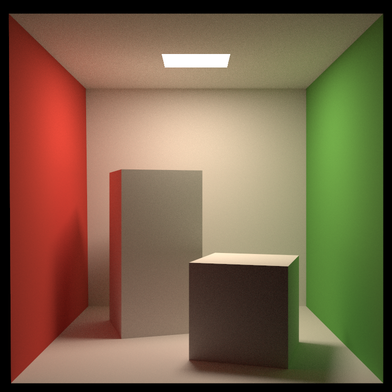
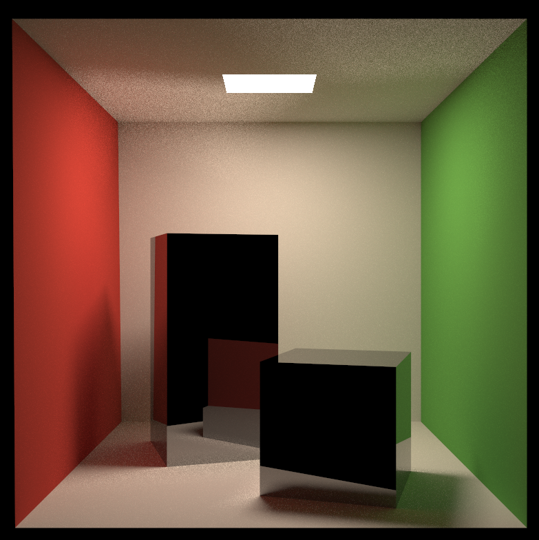
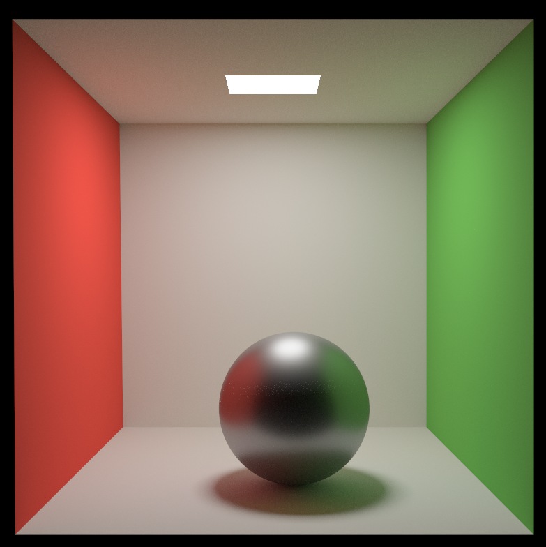
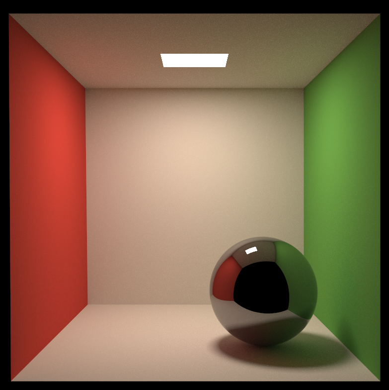
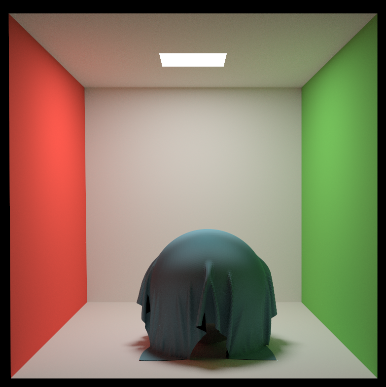
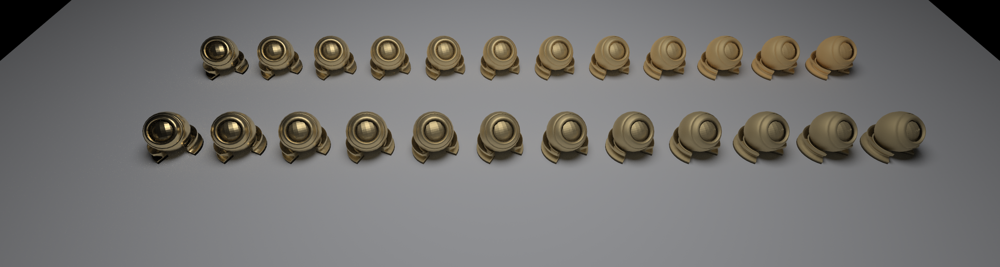

# Danny Render

> This project is modified based on [Glue](https://github.com/isikmustafa/glue).

## spot light

- xml load a obj file contains multi objects

- cloth material

## Gallery

- diffuse



- specular



- metal



- specular



- cloth



- kulla-conty approximate

  上方使用了kulla conty approximate

  

  上方使用了kulla conty approximate

  


## dependency

1. linux
2. cmake
3. glm

## build

```
sh run.sh
```

